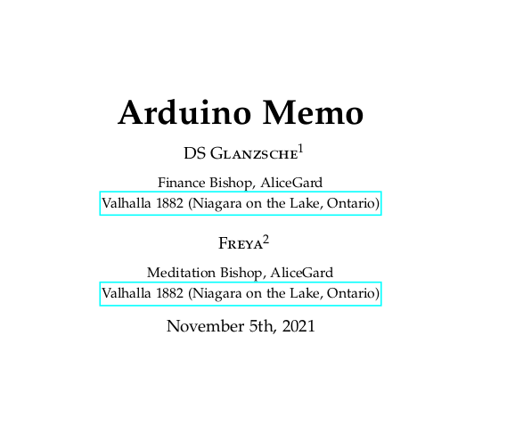
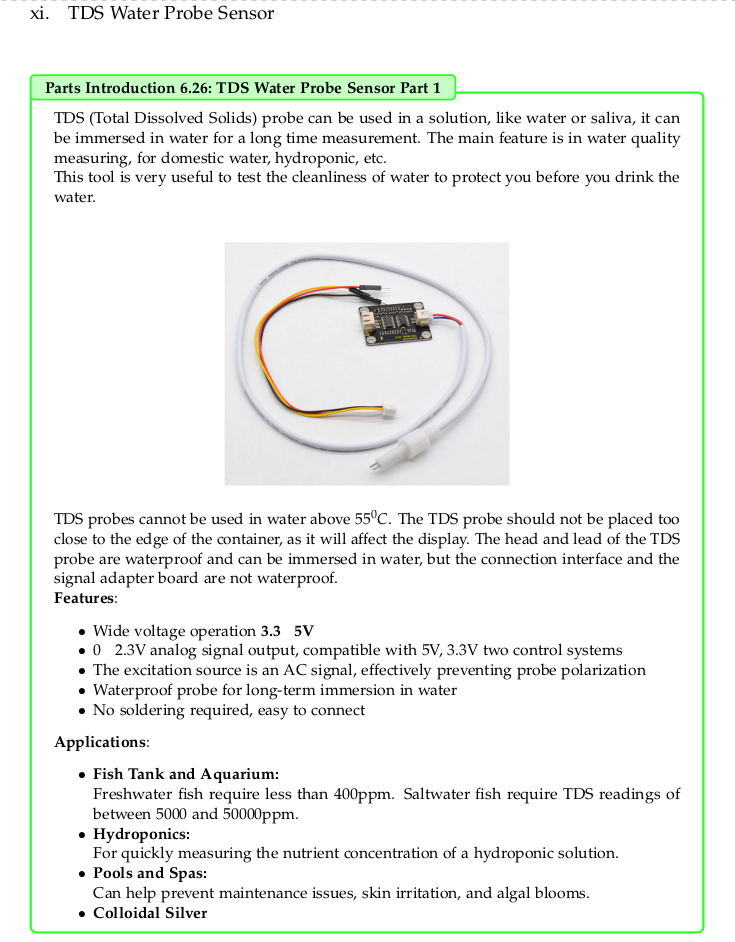

# What Inside Arduino Memo Repository?
This repository contains Arduino Uno' sketch/ino files and Fritzing files for circuit schematic, the guide and tutorial for how to play with Arduino and its sensors, all this files explanation and how to arrange the circuit is in the ArduinoMemo book that will be released as soon as possible.

Made by Glanz and Freya from Valhalla with Love this project is started in November 2021 and postponed recently since March 2022. Till date (April 30th 2022) we are not playing with Arduino Uno because we are focusing on writing science books and polishing GFreya OS with STEM software (VTK, Bullet, Paraview, OpenFOAM, BLAS-LAPACK-ARPACK, Eigen, ODE, Julia, etc).

# Arduino Memo Book

We created a book called "Arduino Memo" but it has not been finished yet (some projects are delayed), furthermore 
we want to edit and revise it, but feel free to take a look at some finished projects.




In this book we compile a lot of sensors and modules that can be useful to train our brain to solve daily problems with Arduino, like Relay to switch on or off a lamp with few configuration (if someone is in the room -> turn on the light for 10 minutes), another example is TDS water sensor that can help us measure the water contamination. Worry not, We got MQ-7 and MQ-135 in this book too, this one is really useful knowing the earth is in the brink of catasthrophe and destruction due to global warming and pollution.



The current book can be seen here (in pdf format):

<a href="https://drive.google.com/file/d/1lT83QpNIWMwZjPMKMXFo4skUL0ufbrAh/view?usp=drive_link">Arduino Memo Book (April 18th, 2024)</a> 

# Gallery of Arduino Memo

| 4WD F18G | BrowniProject | 
| ------------- | ------------- |
|  |  |
| <a href="https://github.com/glanzkaiser/ArduinoMemo/blob/main/F18G_4WD_TestDrive/F18G_4WD_TestDrive.ino">Click</a> | <a href="https://github.com/glanzkaiser/ArduinoMemo/blob/main/BMP280_MQ7_MQ135_Buzzer_LCD/BMP280_MQ7_MQ135_Buzzer_LCD.ino">Click</a> |


# Last Arduino Project
Arduino Uno Wifi R3 ATMega328P and ESP8266 BMP280 to Localhost April 28th, 2024.

4WD F18G (Bluetooth or WiFi control needs to be finished)

# To-Do Lists
1. Focus finish MAX4466 with FFT example and Notes and Chord detector for violin or human voice
2. Solve the problem of Multiplexer Address that can't be found 
3. Add IC from Sparkfun
4. Learn about PROGMEM, and its example
5. Funduino Joystick + Servo
6. Race Car F18G with NRF24L01
7. Try Tetris -> Done (want to enlarge the display and better rotary control)
8. Try Formula F18G -> Done, need to control with A3 analog input joystick (what can replace analog steering wheel?)
9. Try Snake game on LCD I2C 20x4 with Rotary Encoder
10. Stepper Motor need power supply adapter 5V
11. Lithium Battery is out of power can't bring Arduino outside, needs to learn to charge it with solar energy

# Some useful information
    
    BMP280 address 0x77
    SSD1306 Address 0x3C

Ask PCB printing manufacturer in Bandung:

    Single layer 3 days finish IDR 250/cm
    Double layer 7 days finish IDR 725/cm
    * Use Proteus / pdf

## Important

### 1. How to find the value of a resistor


### 2. How DC motor and batteries work to create F18G prototype with Arduino


## Ideas

### 1. Roll a dice with Arduino and LEDs to play Ganz Clever


### 2. Chassis for F18G + Arduino
I really love Need For Speed Underground 2 and want my car to be the best looking car in the Vogue magazine for a car.
Before I create a real sports car handmade with GFreya OS + Bezier Curve + Science and Engineering magic. This is the warming up


# Push Update from Local / Computer to Github

```
git add .
git commit -m "I Love my Wife and We Write Arduino Memo together"
git branch -M main
git remote add origin https://github.com/glanzkaiser/ArduinoMemo.git
git push -u origin main
```

# Status to Finish To-Do Lists

| Status | Link |
| -------------     | ------------- | 
| Notes working but with LCD not working    | https://create.arduino.cc/projecthub/abhilashpatel121/arduino-music-notes-and-chord-detector-728b14?ref=search&ref_id=max4466&offset=4
| Not working for certain soil              | https://makersportal.com/blog/2020/5/26/capacitive-soil-moisture-calibration-with-arduino
| Not yet                                   | https://create.arduino.cc/projecthub/igorF2/solar-charged-battery-powered-arduino-uno-645d89?ref=similar&ref_id=72341&offset=3
| Not yet                                   | https://github.com/HRGiri/record-audio-with-arduino
| Not yet                                   | https://blog.yavilevich.com/2016/08/arduino-sound-level-meter-and-spectrum-analyzer/
| Not yet                                   | https://www.best-microcontroller-projects.com/tp4056.html

